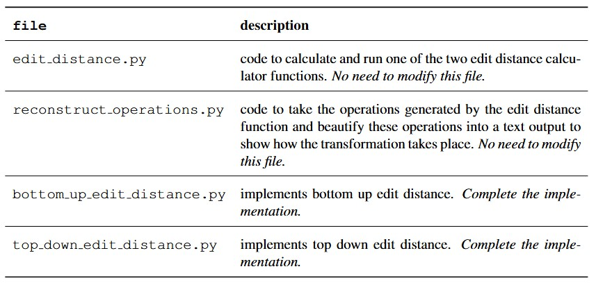

# Dynamic-Programming-Edit-Distance

Contains the skeleton code to implement two versions of the edit distance problem:
- top down; and
- bottom up.

## Learning Objectives

Students who complete this lab will be able to:
- implement two versions of the edit distance; and
- be able to compare them empirically.

# The Edit Distance 

The **edit distance** (also known as Levenshtein distance) is the minimum number of changes needed to convert one string into another.
The allowed operations are:

- **Insert** a character;
- **Delete** a character;
- **Substitute** one character for another; or
- **Match** keep the current character in this slot.

Let `dp[i][j]` represent the minimum cost to convert the first `i` characters of `s1` to the first `j` characters of `s2`.
If the cost of substitution is 1, the edit distance can be defined as:


More generically, if `c` is the cost of substituting one letter for another, the table can therefore be expressed as: 


where the indicator function I_{x} is 1 if x is true, 0 if it is false, so:


To give an example, suppose we want to find the minimum number of operations needed to convert the string
star → tart.

If we already knew the minimum number of operations it takes to convert the following pairs:

- sta → tar
- star → tar
- sta → tart

Then we could use this knowledge to compute the result for star → tart.
The edit distance algorithm builds up this knowledge by recursively solving these smaller subproblems, until it reaches base cases, such as comparing a string to the empty string.

### Example Walkthrough
To transform star into tart, one optimal sequence is:

1. delete 's': star → tar
2. Leave 't', 'a', and 'r' unchanged
3. Insert 't': tar → tart

Total operations: 2. The dynamic programming table would look like:


where:
- yellow boxes represent the back-tracked solution;
- green arrows are an "insertion" operation;
- blue arrows are a "substitution"/"unchanged" operation; and
- red arrows are a "delete" operation

# Algorithms

Here we have two options for dynamic programming: top-down and bottom-up.

## Bottom-up

The bottom up solution algorithm calculates all solutions to all sub-problems for the
original problem (bottom-up) The pseudo-code is given below:


## Top-down

The top-down approach only calculates solutions we require to solve the full problem.
Thus, the dynamic programming table may not become entirely filled. The pseudo-code is given below:


## Information about the code

The file structure and file descriptions are as follows:



To run the code, you have **two** options. Firstly, you can use:

```python edit_distance.py <method> <string 1> <string 2> <bool>```

where:

- `<method>` chooses which edit distance method to use (TD or BU);
- `<string 1>` and `<string 2>` are the selected strings' and
- `bool` is a boolean (true or false) to save the dynamic programming table.

Running the above command with implemented code will give an output like:

``` python edit_distance.py BU superb perturb true```
```commandline
Original string                    → superb
Match 'b'                          → superb
Match 'r'                          → superb
Substitute 'e' with 'u'            → supurb
Substitute 'p' with 't'            → suturb
Substitute 'u' with 'r'            → srturb
Substitute 's' with 'e'            → erturb
Insert 'p' at pos 0                → perturb
Edit Distance: 5
Execution time for BU: 0.000000 seconds
```

Alternatively, you may swap `<string 1>` and `<string 2>` with two positive integers `<n>` and `<m>`. This will
randomly generate two strings to compare of length `n` and `m`. If the strings are very large than the print to terminal
is supressed:

``` python edit_distance.py BU 1 100 100 true```
```commandline      
Edit Distance: 90
Execution time for BU: 0.001999 seconds
```

# Tasks

Implement both the bottom-up and top-down edit distance functions by:
- putting your implementation for bottom-up in `bottom_up_edit_distance.py`; and
- putting your implementation for top-down in `top_down_edit_distance.py`

both in the section labelled `IMPLEMENT ME`.

### Questions
After you have implemented both functions correctly, answer the following questions:
1. What is the maximum problem size you can solve for top down? Why is it not the same for bottom up?
2. Which algorithm runs faster? Why?
3. Run the program for the two strings `internationalisation` and `interpersonalisation`. How would increasing the cost of a substitution change the edit distance and operations?